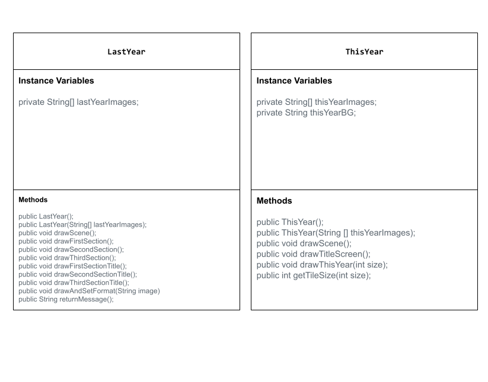

# Project: New Scene, New Me

## Introduction

Software engineers develop programs to create visual and audio experiences using object-oriented programming. As we begin 2026, your goal is to create an animation program that reflects on your experiences from 2025 and visualizes your goals and aspirations for the year ahead using the Theater and Scene API.

## Requirements

Use your knowledge of object-oriented programming, one-dimensional (1D) arrays, algorithms, and the Theater/Scene API to create your animation program:
- **Write Scene subclasses** – Create two Scene subclasses: one to visualize your 2025 recap (LastYear) and another to project your 2026 goals (ThisYear). Each class must include both a no-argument constructor and a parameterized constructor.
- **Use private instance variables** – Implement proper encapsulation by declaring instance variables as private in your Scene subclasses.
- **Create 1D arrays** – Create at least two 1D arrays to store data for your scenes. One array must be created using an initializer list, and one array must be populated by reading from a text file using the FileReader class.
- **Write a method** – Write a method that finds or manipulates the elements in a 1D array to provide the information your user needs.
- **Access and modify array elements** – Use algorithms to traverse, access, and/or modify elements in your 1D arrays to display personalized content in your scenes.
- **Use logic and iteration** – Incorporate selection statements (if/if-else) and loops (while, for, or enhanced for) to control the flow and display of content in your scenes.
Incorporate variety of media – Use at least four different types of Scene API methods across both scenes (examples: drawImage(), drawText(), drawRectangle(), drawEllipse(), playSound(), setTextStyle(), setFillColor(), etc.).
- **Create a UML diagram** – Design a UML class diagram showing your Scene subclasses with their instance variables, constructors, and methods before you begin coding.
- **Document your code** – Use multi-line comments to explain the purpose of each method (including preconditions and postconditions) and single-line comments to explain code segments.

## UML Diagram 

 

## Description of 2025 recap

In my 2025 recap, I included various images of different places, people, and things that I believe sum up my year. I broke this scene into three parts: one for the first few months of the year, another for the middle months, and one more for the ending months. That way, the pictures in the scene are chronologically ordered. I included family photos, landscape photos, and other varying images.

## Description of 2026 goals

In my 2026 goals scene, I chose four images or icon representations to show what I would like to accomplish or do in 2026. I chose sleep because I would like to improve my sleeping habits, I picked a driver's ed test because I want to get my liscense, I chose a page with the number 5 on it because I hope to get 5's on my AP tests, and I picked a plane icon because I would like to travel this summer. I displayed these images in a tile-like manner where each picture square appears in a 2x2 format.

## Scene API Usage

- drawImage() - I used this method to draw each of the pictures I had imported.
- pause() - I created the pauses in the animation so that each image could actually be viewed.
- clear() - I set the background color or cleared the screen with this method.
- setTextHeight() - I set the texts' heights of each title section.
- setTextColor() - I set the texts' colors of each title section.
- setTextStyle() - I set the texts' fonts and styles (bold, italic, etc) of each title section.
- drawText() - I used this to create the text of the title sections.